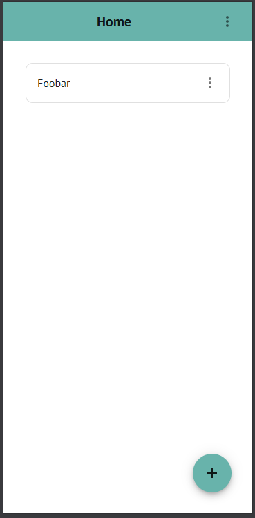

# :zap: Todo App

Stay organised and focused with this simple yet efficient todo application.

[View live demo on GitHub Pages](https://sa9102.github.io/Todo-App/)

[View live demo + code on StackBlitz (Please allow up to 30-40 seconds for the live demo to load)](https://stackblitz.com/~/github.com/SA9102/Todo-App?initialPath=/Todo-App)

This application is still in development. I am working on refactoring and making changes to the previous todo app that I was working on before. See the 'legacy' branch for the old version of the application.

This new version will not only feature a better UI, but also cleaner and more structured code.

This is the master branch which contains the refactored application. To view the old application, see the 'legacy' branch.

My focus right now is on the functionality, so the user interface isn't very appealing at the moment, but I will work on this as the application takes shape.

## Tech Stack

- React
- TypeScript
- Vite
- Vitest
- React Testing Library
- Zustand
- React Router
- MUI

## :control_knobs: Features

- Add tasks
- Edit tasks
- Delete tasks
- Give tasks a name, and optionally a description, category and priority
- Remove all completed tasks at once
- Filter tasks by text within their name or description

See [requirements.md](requirements.md) about the planned features.

Once this application takes shape, I plan to also make this a progressive web application (PWA) so it can be installed as a standalone app.

## Development

The purpose of this project is to see how far I can go and turn a simple, basic todo application into a real productivity tool that is responsive, intuitive and efficient, where the code written is maintainable and broken down into reusable components.

This application will be my most complex one so far, not only in terms of the scope, but also the tech stack and good development practices that I will use, such as adhering to the single responsibility prinicple, and separating the UI from the logic. This project is an opportunity to not only consolidate what I have learnt on my journey of learning, but also to really level up my software development skills and knowledge.

Here are a few key points to note about this project from a development perspective:

<!-- - I have been quite serious about the maintainability and reusability of the code. For this, I have written many custom hooks (something I haven't done before in any project) and higher order components (also something I haven't done before). I have taken care to extract reused logic into its own separate unit which can be extended and reused anytime.
- I have written some tests for each component. Instead of testing for every single detail, they just test the features. -->

- I am using the mobile-first design approach - I am first building for mobile devices, and then will scale up the design to be responsive for bigger screens.
- I am learning to use Vitest and React Testing Library, and I am testing for the main features (see [requirements.md](requirements.md)) of the app, and for proper integration between components. This is my first React application where I am including tests.
- I decided to use some global statement management, as this would be good to store tasks, and would make it easier to scale up the application. For this, I am learning how to use Zustand.
- My first project when I am making use of custom hooks to extract repeated logic, which not only means being able to re-use logic in multiple areas, but also separates the logic from the markup.

## Requirements

See [requirements.md](requirements.md) for more information about the planned, and already-implemented, features.

## Change Log

See [changelog.md](changelog.md) for more information about the changes on each day there was a commit.

## Known Issues

- A task is not visibly marked as completed when it is checked off

<!-- # :zap: Todo App

Stay organised and focused with this simple yet efficient todo application.

This application is not yet complete and is currently being developed on.

[View the application here.](https://sa9102.github.io/Todo-App/)

## :control_knobs: Features

- Create todo items
- A todo item has a name and a priority. It can also optionally have further descriptions, and can also belong to a category
- Can edit todo items, check them off, and delete them
- Can filter items by text

Beware that this application is not yet responsive for smaller devices, though I plan to make it so.

## :bulb: How To Use

- To create a new todo item, click on the green 'NEW TODO' button.
- The name is mandatory, other fields are optional.
- Each todo item has a default priority of 'Low'. You can change it to 'Medium' or 'High'.
- Each todo item by default belongs to no category. You can select a category that it belongs to.
- You can create your own categories, and assign a specific colour to it.

---

- To right of each todo item is an 'EDIT' button and 'DELETE' button. Here, you can edit the specific details of a todo item, or delete one.
- To toggle a todo item between 'Completed' and 'Not Completed', click on the todo item.
- Each todo item has an arrow to the left of its name. You can click on it to expand or minimise the todo item, which will show or hide more details respectively.
- Each todo item has a priority circle to the right of its name. It will be green if the priority is 'Low', orange is 'Medium', and red if 'High'.
- You can click on the priority circle to quickly change the todo item's priority.
- If a todo item belongs to a category, its category name and colour will appear to the right of its priority circle.
- If you have at least one todo item marked as 'Completed', a red button will appear on the toolbar which will delete all completed todo items in one go.
  -- You can filter items by text using the textbox at the top. The text can be in the todo list's name, description, or both.

## :hammer_and_wrench: Upcoming Features

This project is currently in development. Here are a few features I plan to add:

- Order todo items by name, priority, category etc.
- Start and end date
- Or, start date with no end date (i.e. ongoing task)
- End date with no start date (i.e. a deadline)
- Responsiveness for smaller devices
- Have a todo item belong in multiple categories
- Connect to a database to permanently save data

## :desktop_computer: Tech Stack

- React
- TypeScript

I am fairly new to TypeScript, so usage of TypeScript is limited. I have used it to define the 'type' of a todo item, as well as the type of props for different components.

React context is used to allow todo items to access the functions that manipulate its own objects in state, avoiding prop drilling.

I use custom CSS variables to help maintain a consistent colour scheme in the application.

I have optimised the speed of the application by making use of useMemo wherever I can, to ensure that specific values (such as filtered todo items) are re-calculated only when they need to, and not everytime a single update is made to the DOM.

## :package: Dependencies

- [react-modal](https://www.npmjs.com/package/react-modal)

## :chart_with_upwards_trend: Update Log

### 16th December 2024

- You can now filter items by category

### 15th December 2024

- Added a new branch "frontend+backend" where I am working on the backend

### 12th December 2024

- Tidied up code and added comments
- The 'edit' and 'delete' buttons of a todo item now appear only when you hover over it

### 11th December 2024

- A button for removing all completed todo items in one go
- Assign colours to categories
- Have the category name and colour appear on each todo item
- Adjust the colour of the category name (black or white) based on the background color, for better contrast
- Filter items by text in both name and description

### 10th December 2024

- Quickly change a todo item's priority by clicking on the priority circle

### 9th December 2024

- Changed design, and added a few features:
  - Expand/minimise a task to show/hide its description
  - Priority circle next to task name, the colour depicting priority - green for low, orange for medium, red for high

### 7th November 2024

- Repository created and first commit.

## :warning: Known Issues

- Not yet responsive for tablet and mobile devices. -->
